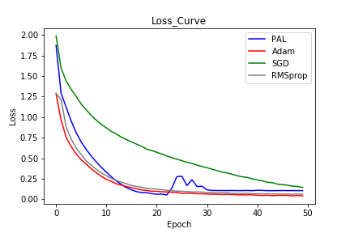
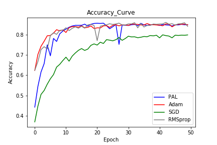

&nbsp;
				HTML
				
					
				
				
						
				
			Lab Final Report

| Student          | LIANG JUNHUA                                                 |
| ---------------- | ------------------------------------------------------------ |
| **ID**           | **16340129**                                                 |
| **Paper Title**  | **PAL: A fast DNN optimization method based on curvature information.** |
| **Paper Author** | **Maximus Mutschler, Andreas Zell**                          |

## Description

&nbsp;&nbsp;&nbsp;&nbsp;&nbsp;&nbsp;&nbsp;&nbsp;This paper introduces us one kind of novel optimization algorithm called **Parabolic Approximation Line** search, which also be simplified as **PAL**. It is different from the traditional optimization such as **SGD**, **Adam** and **RMSprop**, which only use the information of the first order. **PAL** uses both the gradient and curvature, which efficiently make the deep learning model converge to the result. In addition, since **PAL** do not have to calculate the Hessian Matrix when it has to get the information of curvature, it performs better than the optimizations that also use the curvature information involving **K-FAC** and **L-SR1**. I will reproduce the method of this paper by myself using Pytorch.

&nbsp;&nbsp;&nbsp;&nbsp;&nbsp;&nbsp;&nbsp;&nbsp;The paper describes that this kind of method have the capacity to converge quickly compared to other optimizer. However, after I implemented his method and make a comparison, I found that traditional optimizers such as Adam have higher effectiveness after adjusting the hyperparameters, and it cost less time to run the program, so though this kind of method make use of both the gradient and curvature, its efficiency is awful and have limited in industrial production. In addition, it seems that it have risk diverging.

&nbsp;&nbsp;&nbsp;&nbsp;&nbsp;&nbsp;&nbsp;&nbsp;The paper link is here: [**PAL: A fast DNN optimization method based on curvature information.**](<https://arxiv.org/abs/1903.11991>)

---

## Experiment

&nbsp;&nbsp;&nbsp;&nbsp;&nbsp;&nbsp;&nbsp;&nbsp;Since this paper offers the pseudo code, I could just follow what it describes on it. For the neural network, the paper recommends the Resnet34, however, when I experiment, I observe that it does awful, and thus I change it to Resnet18. The Resnet18 code is follows the code on the deep learning class with a little change. Since the implementation of Resnet18 is the key issue of this experiment, you could see the code from my github, it is the same as other Resnet's implementation.

&nbsp;&nbsp;&nbsp;&nbsp;&nbsp;&nbsp;After I define the network, I am able to reproduce the optimization. The optimization have some parameters that is new to me. They are **Maximum step size** $\mu$, **Momentum** $\alpha$, **Loose Approximation** $\lambda$, **Decay** $d(i,t)$,  I set them as the parameters of the optimization and define as follows:

``` python
def __init__(self, params, mss=0.9, mmt=0.4, lat=0.6, max_ss=3.0, eps=1e-8)
```

&nbsp;&nbsp;&nbsp;&nbsp;&nbsp;&nbsp;&nbsp;&nbsp;All the initial parameters are the recommended values from the paper. Then what I have to do is calculating the value of the gradient and curvature. The **PAL** uses two forward steps to calculate them, which seems more complexity, but in fact more efficiency without calculating the Hessian Matrix. Their code are now as follows:

``` python
loss_0, *returns = loss_func(model, images, target, backward=True)
grad_norm, loss_d0 = self.get_norm_derv(params, mmt, eps)
            
 # Update with length mss.
self.update(params, mss, grad_norm)
loss_mss, *_ = loss_func(model, images, target, backward=False)
            
# Derivative
loss_d1 = (loss_mss - loss_0) / mss;
loss_d2 = lat * (loss_d1 - loss_d0) / (mss / 2)
```

&nbsp;&nbsp;&nbsp;&nbsp;&nbsp;&nbsp;&nbsp;&nbsp;The following thing I have to do is implementing the case discrimination of parabolic approximations, since not all parabolic approximations are suitable for parameter update steps.  The code is as follows:

``` python
# Case discrimination.
if (loss_d2 > 0 and loss_d0 < 0):
    sup = -(loss_d0 / loss_d2)
elif (loss_d2 <= 0 and loss_d0 < 0):
    sup = torch.tensor(mss)
else:
    sup = torch.tensor(0.0)
```

&nbsp;&nbsp;&nbsp;&nbsp;&nbsp;&nbsp;&nbsp;&nbsp;Besides all I mentioned above, I add the decay factor which is mentioned in the paper but I ignored last time, it reduces the maximum step size and measuring step size every time which is similar to the decay of learning rate in Adam. I try this way and observe that it increases the accuracy and have lower loss value.

```python
#------------------------ Decay Update -----------------------#
mss_tmp = 0.0
mas_tmp = 0.0
for param_group in optimizer.param_groups:
    mss_tmp = param_group['mss']
    mas_tmp = param_group['max_ss']

   decay_factor = decay_rate ** (((epoch + 1) * step_rate + idx) / decay_step)
   mss_new = mss_tmp * decay_factor
   mas_new = mas_tmp * decay_factor

   for param_group in optimizer.param_groups:
       param_group['mss'] = mss_new
       param_group['mas'] = mas_new
#------------------------ Decay Update -----------------------#
```

&nbsp;&nbsp;&nbsp;&nbsp;&nbsp;&nbsp;&nbsp;&nbsp;That's all the key point of implementing the PAL Optimizer. After that I also run Adam, SGD and RMSprop Optimizer for the Resnet18, and make comparison of them. The total epoch is 50, and learning rate for Adam, SGD and RMSprop is 0.0001, hyperparameters of PAL are set according to the paper, momentum of SGD is 0.9.  Some training log are shown as follows:

```python
#-----------PAL-----------#			#-----------Adam----------#
Epoch [45] Loss: 0.1085				Epoch [45] Loss: 0.0489
Epoch [45] Accuracy: 0.8488			Epoch [45] Accuracy: 0.8482
Epoch [46] Loss: 0.1069				Epoch [46] Loss: 0.0492
Epoch [46] Accuracy: 0.8487			Epoch [46] Accuracy: 0.8514
Epoch [47] Loss: 0.1076				Epoch [47] Loss: 0.0429
Epoch [47] Accuracy: 0.8514			Epoch [47] Accuracy: 0.8519
Epoch [48] Loss: 0.1069				Epoch [48] Loss: 0.0478
Epoch [48] Accuracy: 0.8494			Epoch [48] Accuracy: 0.8526
Epoch [49] Loss: 0.1069				Epoch [49] Loss: 0.0429
Epoch [49] Accuracy: 0.8492			Epoch [49] Accuracy: 0.8491
Program run time: 3634.21s			Program run time: 1829.65s
#-----------PAL-----------#			#-----------Adam----------#
        
#-----------SGD-----------#			#----------RMSprop--------#
Epoch [45] Loss: 0.1796				Epoch [45] Loss: 0.0650
Epoch [45] Accuracy: 0.7979			Epoch [45] Accuracy: 0.8478
Epoch [46] Loss: 0.1721				Epoch [46] Loss: 0.0657
Epoch [46] Accuracy: 0.7964			Epoch [46] Accuracy: 0.8539
Epoch [47] Loss: 0.1605				Epoch [47] Loss: 0.0628
Epoch [47] Accuracy: 0.7981			Epoch [47] Accuracy: 0.8551
Epoch [48] Loss: 0.1570				Epoch [48] Loss: 0.0653
Epoch [48] Accuracy: 0.7976			Epoch [48] Accuracy: 0.8594
Epoch [49] Loss: 0.1442				Epoch [49] Loss: 0.0648
Epoch [49] Accuracy: 0.7991			Epoch [49] Accuracy: 0.8416
Program run time: 1811.46s			Program run time: 1818.09s
#-----------SGD-----------#			#----------RMSprop--------#
```

&nbsp;&nbsp;&nbsp;&nbsp;&nbsp;&nbsp;&nbsp;&nbsp;From the data shown above, we could see that though PAL may have higher accuracy, traditional optimizers perform better as they cost little time, which is really important in practical use. And we get the final accuracy rate of each optimizer is PAL: $84.92 \%$, Adam: $84.91 \%$, RMSProp: $84.16 \%$, SGD: $79.91 \%$, the time PAL runs is twice the others as it calculates the curvature while others do not.

&nbsp;&nbsp;&nbsp;&nbsp;&nbsp;&nbsp;&nbsp;&nbsp;Then I draw the figure of the loss curve and accuracy curve, and they are shown as follows:

<figure class="half">
    
    
</figure>

&nbsp;&nbsp;&nbsp;&nbsp;&nbsp;&nbsp;&nbsp;&nbsp;From the two figures above, I observe that SGD always shows the worst, and PAL, Adam and RMSprop perform appropriately, but Adam performs more stable while RMSprop and PAL have some fluctuation during the training. 

---

## Conclusion

&nbsp;&nbsp;&nbsp;&nbsp;&nbsp;&nbsp;&nbsp;&nbsp;In conclusion, the PAL Optimizer does not perform its advantages mentioned in the paper, maybe I miss some details, but I have tried to improve and avoid it several times. If I ignore the running time of the program, it may have some higher accuracy. However, since it has more calculation, it definitely costs more time than other optimizer that only calculate the gradient. So I think that this model still have some aspects to be improved, and the authors of this paper also acknowledge that it does have some drawbacks and will improve it in the later time. I would follow the authors' proceeding work and promise that it would have great breakpoint of the optimizer.